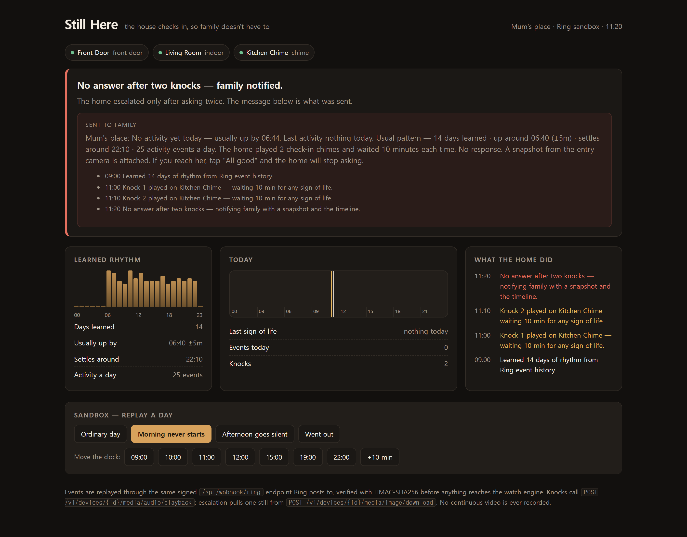

# Still Here

**The house checks in, so family doesn't have to.**

Still Here watches a Ring household the way a good neighbour would: it learns what an
ordinary day looks like, notices when the day stops looking ordinary, and — this is the part
that matters — **knocks before it alarms**. It plays a chime and treats *any* sign of life as
an answer. Family is only pulled in when the home itself could not get one.

Built for the **Build, Ship, Shape: Amazon Developer Hackathon**, Ring track
(priority categories: caretaking, accessibility).



---

## Why knock first

Every "is mum okay?" product on the market solves the easy half — detect an anomaly, send a
push notification. In a real household that design fails twice a week: she slept in, she was
in the garden, the cat set off the hallway camera. After the third false alarm the family
mutes the app, and the app is now worse than nothing.

So Still Here spends its first move on the *home*, not the phone:

| Phase | What happens | Who is disturbed |
|---|---|---|
| `calm` | rhythm matches history | nobody |
| `knocking` | chime plays on the Ring chime — "are you there?" | only the person at home |
| `answered` | any motion, doorbell press or door event after the chime | nobody — the incident closes silently |
| `escalated` | two unanswered knocks | family, with evidence |

The person at home answers by **walking past a camera**. No phone, no app, no button — which
is exactly why it works for the people this is built for.

---

## What it uses from the Ring Partner API

| Purpose | Endpoint |
|---|---|
| Learn the household rhythm | `GET /v1/history/devices/{id}/events` |
| Watch in real time | webhook **v1.1** (`motion_detected`, `button_press`, `device_offline`), verified with `X-Signature` HMAC-SHA256 |
| Knock | `POST /v1/devices/{id}/media/audio/playback` (`audio_ref`, requires *Chime Controls*) |
| Evidence on escalation | `POST /v1/devices/{id}/media/image/download` — one still, only at escalation |
| Optional live check | `POST /v1/devices/{id}/media/streaming/whep/sessions` (WHEP/WebRTC) |
| Inventory & health | `GET /v1/devices`, `/status`, `/capabilities`, `/configurations`, `GET /v1/users/me` |

Devices are mapped to **roles** (`front_door`, `indoor`, `chime`) rather than model names, so
the engine reasons about "the front door opened", not about a particular Ring SKU.

---

## Run it

```bash
npm install
npm run dev            # http://localhost:3000
```

That starts in **sandbox mode**: 14 days of synthetic history, a replayable day, and four
scenarios you can trigger from the dashboard. Every simulated event is POSTed to the real
`/api/webhook/ring` route with a real HMAC signature, so the demo exercises the same
verify → parse → engine path as production traffic.

### Point it at a real Ring account

1. Open the [Ring Developer Playground](https://developer.amazon.com/ring/console/playground) → **Generate Token**.
2. `cp .env.example .env.local` and paste the token into `RING_ACCESS_TOKEN`.
3. Check what the account exposes:
   ```bash
   npx tsx scripts/ring-probe.ts
   ```
4. `curl -X POST localhost:3000/api/live` — the dashboard reloads with real devices, real
   history and a rhythm learned from that household.

Playground tokens last about 30 minutes. For a long-running deployment use the OAuth refresh
token flow and set `RING_WEBHOOK_SECRET` so webhook signatures are enforced (they are
mandatory when `NODE_ENV=production`).

---

## How the rhythm model works

`lib/rhythm/model.ts` reduces event history to four things a caregiver can sanity-check on
the dashboard:

- **first presence** and **last presence** per local day → median and MAD (a single 3am
  bathroom trip must not redefine "morning")
- **hourly presence probability** → also gives us *quiet hours*, so the home never knocks at 4am
- **p90 waking gap** → how long this particular household normally goes quiet mid-day

`lib/rhythm/engine.ts` is a pure function of `(state, events, model, now)`. It produces
`knock` / `escalate` / `resolve` actions and nothing else — no timers, no I/O — which is why
the escalation policy is covered by unit tests rather than hope:

```bash
npm test        # 18 tests
```

Guards that come from that test suite:

- never alerts on fewer than 7 learned days (`isConfident`)
- never knocks during learned quiet hours
- gives someone who left through the front door an away-grace before worrying
- ignores non-human motion (`sub_type: vehicle`) as a sign of life
- stands down even *after* escalating, if she walks past a camera at 11:03

---

## Privacy, deliberately

- No continuous recording, no stored video. A single still is pulled **only** at escalation.
- The knock is a chime, not a microphone — nothing is listened to.
- Household state is a rhythm model plus one day of events: a few kilobytes, in memory,
  never sold, never sent anywhere except the family message.
- Webhook payloads are rejected unless the HMAC signature verifies.

---

## AWS

The family message is assembled deterministically first (`lib/notify/summary.ts`) — facts,
timeline, what the home tried — and Amazon Bedrock is then asked to *rewrite* it kindly, never
to reason about what happened. If AWS is not configured, the rules version ships as-is, so
the safety path never depends on a model being reachable.

```env
AWS_REGION=us-east-1
BEDROCK_MODEL_ID=anthropic.claude-3-5-sonnet-20241022-v2:0
```

---

## Layout

```
app/
  api/webhook/ring/    signature verification → parse → engine
  api/household/       everything the dashboard polls
  api/sim/             replay a scenario through the signed webhook path
  api/live/            switch to a real Ring account
  page.tsx             the caregiver dashboard
lib/
  ring/                API client, webhook types, HMAC verification
  rhythm/              rhythm model + watch engine (pure, tested)
  sim/                 synthetic household: 14 days of history + four scenarios
  notify/              family message (rules, optionally rephrased by Bedrock)
scripts/ring-probe.ts  inspect a real account from the terminal
```

## Licence

MIT — see [LICENSE](LICENSE).
